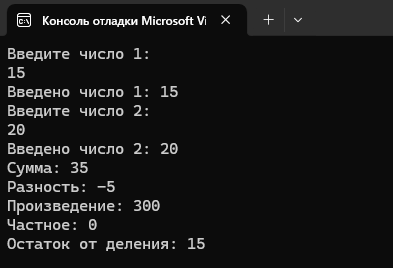
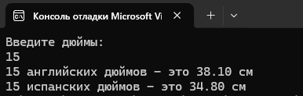
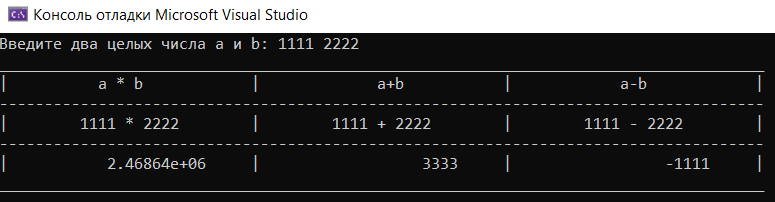
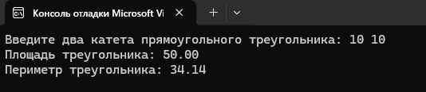

# Лабораторная работа 3. Ввод/вывод данных

## Задание 1
Реализуйте программу со вводом данных с клавиатуры.

## Задание 2
Реализуйте программу пересчета целых дюймов в см (английский дюйм равен 2,54 см).

## Задание 3*
Напишите программу для получения следующего вида на экране.

## Домашнее задание
Написать и отладить программу вычисления площади и периметра прямоугольного треугольника по двум сторонам.

### Блок-схема
